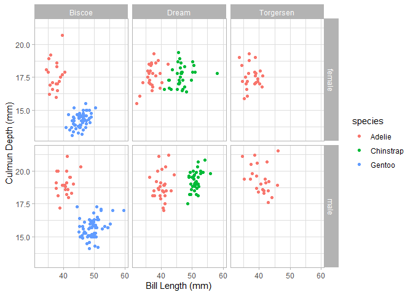

<!-- README.md is generated from README.Rmd. Please edit that file -->

# mpipe 

<!-- badges: start -->

[](https://github.com/MyKo101/mpipe/actions)
[](https://codecov.io/gh/MyKo101/mpipe?branch=main)
[](https://github.com/MyKo101/mpipe)

<!-- badges: end -->

The `mpipe` package is designed to add to extra functionality to the
“pipelining” of `tidyverse` style processes. When running a pipeline,
it is common to break out of a pipeline to perform other actions, and
then to commence a new pipeline. `mpipe` aims to permit a stronger use
of pipelining, whilst reducing the need to break out. This piece of
software is still under very active development and suggestions for
improvements are welcome.

## Installation

You can install the development version of `mpipe` from
[GitHub](https://github.com/MyKo101/mpipe) with:

``` r
# install.packages("devtools")
# devtools::install_github("MyKo101/mpipe")
library(mpipe)
```

The `mpipe` package is not currently available on CRAN.

### Examples

The `palmerpenguins` package provides data on three species of penguins
(Gentoo, Adelie and Chinstrap) over three islands (Biscoe, Dream and
Torgersen). We’ll use the length and depth of their bills. A lot of the
examples in this page are rather convoluted (and for many, there are
other easier ways to get the same results, but they’re here to
demonstrate `mpipe` functionality)

``` r
mutils::load_packages(dplyr, magrittr, palmerpenguins, mutils, ggplot2)

penguins <- palmerpenguins::penguins %>% 
  select(-body_mass_g,-flipper_length_mm) %>%
  filter_all(~!is.na(.))
```

## fseq

A little used feature of the `magrittr` package’s `%>%` pipe is that is
can be used to create functions. By using a `.` as the initial argument,
the output will be a function and can be applied to other pieces of
data. These kinds of functions are called `fseq` functions (short for
functional sequences).

``` r
summarise_my_data <- . %>%
  group_by(species,island,sex) %>%
  summarise_all(mean,.groups="keep")
summarise_my_data
#> Functional sequence with the following components:
#> 
#>  1. group_by(., species, island, sex)
#>  2. summarise_all(., mean, .groups = "keep")
#> 
#> Use 'functions' to extract the individual functions.

summarise_my_data(penguins)
#> # A tibble: 10 x 5
#> # Groups:   species, island [5]
#>    species   island    sex    bill_length_mm bill_depth_mm
#>    <fct>     <fct>     <fct>           <dbl>         <dbl>
#>  1 Adelie    Biscoe    female           37.4          17.7
#>  2 Adelie    Biscoe    male             40.6          19.0
#>  3 Adelie    Dream     female           36.9          17.6
#>  4 Adelie    Dream     male             40.1          18.8
#>  5 Adelie    Torgersen female           37.6          17.6
#>  6 Adelie    Torgersen male             40.6          19.4
#>  7 Chinstrap Dream     female           46.6          17.6
#>  8 Chinstrap Dream     male             51.1          19.3
#>  9 Gentoo    Biscoe    female           45.6          14.2
#> 10 Gentoo    Biscoe    male             49.5          15.7
```

The `mpipe` package includes a couple of extra things that can be done
to these kinds of functions, including composition of `fseq` by adding
them together. We’ll define another `fseq` to filter out some penguins
and variables.

``` r
filter_my_data <- . %>%
  filter(bill_length_mm > 43) %>%
  select(species,island,sex,bill_length_mm)
filter_my_data
#> Functional sequence with the following components:
#> 
#>  1. filter(., bill_length_mm > 43)
#>  2. select(., species, island, sex, bill_length_mm)
#> 
#> Use 'functions' to extract the individual functions.
```

Then we can create the composite functional sequence

``` r
filter_my_data + summarise_my_data
#> Functional sequence with the following components:
#> 
#>  1. filter(., bill_length_mm > 43)
#>  2. select(., species, island, sex, bill_length_mm)
#>  3. group_by(., species, island, sex)
#>  4. summarise_all(., mean, .groups = "keep")
#> 
#> Use 'functions' to extract the individual functions.
```

We can either assign this to a new function name, or apply it to the
data implicitly (using brackets)

``` r
(filter_my_data + summarise_my_data)(penguins)
#> # A tibble: 7 x 4
#> # Groups:   species, island [5]
#>   species   island    sex    bill_length_mm
#>   <fct>     <fct>     <fct>           <dbl>
#> 1 Adelie    Biscoe    male             44.4
#> 2 Adelie    Dream     male             43.7
#> 3 Adelie    Torgersen male             44.8
#> 4 Chinstrap Dream     female           47.2
#> 5 Chinstrap Dream     male             51.1
#> 6 Gentoo    Biscoe    female           46.0
#> 7 Gentoo    Biscoe    male             49.5
```

The `mpipe` package also includes a `length()` method for `fseq` which
returns the number of elements in the functional sequence, as well as a
pair of functions to check whether something is an `fseq`: `is.fseq()`
and `is_fseq()` (depending on your own preference). More functions for
using `fseq` to their full potential will be added in future releases.

## Side Effects

A large reason for breaking out of a pipeline is to do actions such as
plotting or providing feedback to the user. the `mpipe` package provides
two functions that are particularly useful for avoiding leaving a
pipeline. The way this is done is that the functions side effects are
activated, but the functions return an untouched version of the data it
was originally provided. This is similar to using the `%T>%` pipe in
magrittr, but can be done with the traditional `%>%` pipe and is
explicit in the name of the function.

  - `pipe_qplot()` - allows the user to create `ggplot2` style plots
    using `qplot()` syntax (akin to the base R `plot()` syntax). This is
    essentially a wrapper function that also permits saving and theming
    of the plots.
  - `pipe_cat()` - allows the user to output information to the console
    (or any other sink) in the much the same way that `cat()` does. Any
    calls/functions will be evaluated appropriately for this output.
    Grouped tibbles will be parsed separately.

Here we will create a plot of Bill length against Bill depth stratified
by the three grouping variables: `species`, `sex` and `island.` We’ll
colour-code `species` using `col = species`, and `facets = sex ~ island`
will create facets based on these two variables. We will then focus on
the Biscoe island penguins (using `filter()`), and output the average
Bill length, then stratify it by sex and species. Finally, we will
return a dataset that contains the mean of Bill length and depth across
these groups.

``` r
penguins %>%
  pipe_qplot(bill_length_mm, bill_depth_mm, col = species,
             xlab = "Bill Length (mm)", ylab = "Culmun Depth (mm)",
             theme = "light", facets = sex ~ island) %>%
  filter(island == "Biscoe") %>% 
  pipe_cat("Biscoe Average Culmun Length (mm):", mean(bill_length_mm), "\n\n") %>%
  group_by(species,sex) %>%
  pipe_cat(sex, species, "Average Culmun Length (mm):", mean(bill_length_mm), "\n") %>%
  summarise_if(is.numeric, mean)
```



    #> Biscoe Average Culmun Length (mm): 45.24847 
    #> 
    #> female Adelie Average Culmun Length (mm): 37.35909 
    #> male   Adelie Average Culmun Length (mm): 40.59091 
    #> female Gentoo Average Culmun Length (mm): 45.56379 
    #> male   Gentoo Average Culmun Length (mm): 49.47377
    #> # A tibble: 4 x 4
    #> # Groups:   species [2]
    #>   species sex    bill_length_mm bill_depth_mm
    #>   <fct>   <fct>           <dbl>         <dbl>
    #> 1 Adelie  female           37.4          17.7
    #> 2 Adelie  male             40.6          19.0
    #> 3 Gentoo  female           45.6          14.2
    #> 4 Gentoo  male             49.5          15.7

## Control Flow

One of the key aspects of programming is being able to manipulate which
lines of code are ran and when. This manipulation is called “Control
Flow” (i.e. you control the flow of the processes through your code).
The two main methods of this are via branches and loops. Branches force
our code to make a choice, where loops allow repetition of the same
lines of code.

In traditional R (as in many other languages), Branching is performed
using `if()` or `switch()` statements, and can also be vectorised with
functions such as `if_else()` and `case_when()`. Loops are implemented
using the `for()`, `while()` and `repeat()` statements and can
essentially be vectorised using the `apply()` and `map()` families of
functions.

the `mpipe` package allows us to integrate this kind of control flow
into a pipe by supplying different paths for data to follow based on a
predicate, case or condition. Branches are implemented via the
`if_branch()` and `switch_branch()` functions, and loops are implemented
via the `while_pipe()` function.

### Branches

#### if\_branch()

The `if_branch()` works similar to an `if` statement. The function
chooses whether to data should proceed down the `fun` branch or the
`elsefun` branch (if supplied) depending on how `predicate` is
evaluated.

First, we’ll define an `fseq` style function, and apply it to the data
twice. The `fseq` function will first shuffle the data and then if a
male penguin ends up at the top of our list, we’ll pick just the Biscoe
island penguins and extract the bill length summary statistics, if a
female penguin ends up on top, we’ll pick out the Biscoe & Dream island
penguis and extract the bill depth summary statistics.

``` r
f <- . %>%
  sample_n(nrow(.)) %>% #Shuffle the data
  if_branch(sex[1] == "MALE", #predicate: Is the top row a male penguin?
            . %>% #TRUE path
              pipe_cat("Male penguin on top, extracting Bill Length for Biscoe penguins\n") %>%
              filter(island == "Biscoe") %>%
              pull("bill_length_mm") %>%
              summary(), # End of TRUE Path
            . %>% #FALSE path
              pipe_cat("Female penguin on top, extracting Bill Depth for Biscoe & Dream penguins\n") %>%
              filter(island != "Torgersen") %>%
              pull("bill_length_mm") %>%
              summary()) # End of FALSE Path & end of if_branch()
              
```

``` r
set.seed(1)
f(penguins)
#> Female penguin on top, extracting Bill Depth for Biscoe & Dream penguins
#>    Min. 1st Qu.  Median    Mean 3rd Qu.    Max. 
#>   32.10   40.52   45.55   44.81   49.20   59.60
```

``` r
set.seed(2)
f(penguins)
#> Female penguin on top, extracting Bill Depth for Biscoe & Dream penguins
#>    Min. 1st Qu.  Median    Mean 3rd Qu.    Max. 
#>   32.10   40.52   45.55   44.81   49.20   59.60
```

#### switch\_branch()

Similarly, the `switch_branch()` function allows us to expand on this by
following a different path depending on the evaluation of `case`. The
`case` argument will be evaluated in the context of `data` and shoudl
return either a character value or a numeric value. Characters will be
matched to the other arguments provided to the `switch_branch()`
function and numerics will be matched by position.

This time, we will do similar to the previous example except checking
which island ends up on top. We can see from the below (using the
`table()` function overloaded by the `mutils` package), that if
Torgersen is chosen as our random island, only Adelie penguins will be
in our output.

``` r
penguins %>%
  table(species,island)
#>            island
#> species     Biscoe Dream Torgersen
#>   Adelie        44    55        47
#>   Chinstrap      0    68         0
#>   Gentoo       119     0         0
```

This means we can drop this level and output only based on sex.
`switch_branch()` will output the data untouched if `case` doesn’t match
any of the other arguments supplied. So we will adapt our function for
this:

``` r
f <- . %>%
  sample_n(nrow(.)) %>%
  pipe_cat(as.character(island[1]),"island is on top, so it will be chosen.\n") %>%
  filter(island == island[1]) %>%
  group_by(species,sex) %>%
  switch_branch(. %>% # What island ends up at the top row?
                  slice(1) %>% #This time, we write case as an `fseq` as well.
                  pull("island") %>%
                  as.character,
                Torgersen = . %>%
                  ungroup %>% 
                  pipe_cat("\t\tSpecies will be dropped.\n") %>%
                  group_by(sex) %>%
                  select(-species)) %>%
  summarise_if(is.numeric,mean)
```

``` r
## Force the "random" shuffle to put a "Biscoe" species is at the top
set.seed(100)
f(penguins)
#> Biscoe island is on top, so it will be chosen.
#> # A tibble: 4 x 4
#> # Groups:   species [2]
#>   species sex    bill_length_mm bill_depth_mm
#>   <fct>   <fct>           <dbl>         <dbl>
#> 1 Adelie  female           37.4          17.7
#> 2 Adelie  male             40.6          19.0
#> 3 Gentoo  female           45.6          14.2
#> 4 Gentoo  male             49.5          15.7
```

``` r
## Force the "random" shuffle to put a "Torgersen" species is at the top
set.seed(1000)
f(penguins)
#> Torgersen island is on top, so it will be chosen.
#>      Species will be dropped.
#> # A tibble: 2 x 3
#>   sex    bill_length_mm bill_depth_mm
#>   <fct>           <dbl>         <dbl>
#> 1 female           37.6          17.6
#> 2 male             40.6          19.4
```

### Loops

In terms of loops, we introduce the `while_pipe()` function which acts
similar to a `while()` loop, but within a pipeline. It will repeatedly
apply the `fun` argument to the `data` until `cond` is not `TRUE`.
`cond` will be evaluated within the context of `data` at each iteration.

For this example, we’re simply going to shuffle until the first penguin
is a female and then output the top 5 results.

``` r
penguins %>%
  while_pipe(sex[1] != "female",
             . %>%
               sample_n(nrow(.))) %>%
  slice(1:5)
#> # A tibble: 5 x 5
#>   species   island bill_length_mm bill_depth_mm sex   
#>   <fct>     <fct>           <dbl>         <dbl> <fct> 
#> 1 Adelie    Biscoe           35            17.9 female
#> 2 Adelie    Dream            40.9          18.9 male  
#> 3 Chinstrap Dream            51.3          19.9 male  
#> 4 Gentoo    Biscoe           50.5          15.9 male  
#> 5 Adelie    Biscoe           39            17.5 female
```

The `while_pipe()` function also provides a `.counter` pronoun to keep
track of how many times the loop as been run. This can be used within
`cond` and within `fun` and even allows for simple leves of tidy
evaluation.

``` r
tibble(x = runif(5)) %>%
  while_pipe(.counter <= 5,
             . %>%
               mutate(!!paste0("x_",.counter) := x - x[.counter]))
#> # A tibble: 5 x 6
#>        x   x_1    x_2     x_3     x_4     x_5
#>    <dbl> <dbl>  <dbl>   <dbl>   <dbl>   <dbl>
#> 1 0.0852 0     -0.578 -0.219  -0.151  -0.301 
#> 2 0.663  0.578  0      0.359   0.427   0.277 
#> 3 0.304  0.219 -0.359  0       0.0682 -0.0815
#> 4 0.236  0.151 -0.427 -0.0682  0      -0.150 
#> 5 0.386  0.301 -0.277  0.0815  0.150   0
```

## Code of Conduct

Please note that the mpipe project is released with a [Contributor Code
of Conduct](https://michaelbarrowman.co.uk/mpipe/CODE_OF_CONDUCT.html).
By contributing to this project, you agree to abide by its terms.

## References

`palmerpenguins`

Gorman KB, Williams TD, Fraser WR (2014) Ecological Sexual Dimorphism
and Environmental Variability within a Community of Antarctic Penguins
(Genus Pygoscelis). PLoS ONE 9(3): e90081.
<https://doi.org/10.1371/journal.pone.0090081>
